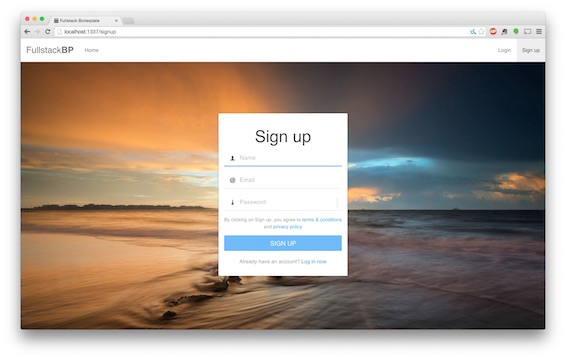
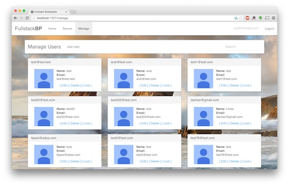

#A fullstack boilerplate using Express 4, MongoDB, AngularJS, and JWT Auth






###High level list of (probably) working features:
------------------------------------------
1. User registration, login, password reset functionality
2. Email confirmations for password reset and account registration
3. Very basic user management (add/remove user, lock account, reset password, change name, change email, etc)
4. 'Random' background directive to keep you sane as you dev =p
5. Password strength and valid email directives

###Install instructions:
------------------------------------------

You will need to create a directory named `config` with a file named `secrets.js` containing the following:
example

`config/secrets.js`:
```javascript
module.exports = {

  db: process.env.MONGODB || 'mongodb://localhost/## YOUR_DATABASE_NAME ##', // your mongodb connection string
  jwt: process.env.JWT || 'SUPERSECUREJWTSEED', // a unique string to use as an encryption seed
  smtpuser: process.env.SMTPUSER || 'SENDGRID_USERNAME', // SMTP settings are provided when you sign up
  smtppassword: process.env.SMTPPASSWORD || 'SENDGRID_PASSWORD', // for a free sendgrid account (https://sendgrid.com/)
  company: process.env.COMPANY || 'YOURCOMPANYNAME' // This can be any string, it is used for the mail templates)

  };
```

Once the config/secrets.js file is created run `npm install` in the project directory and then make sure you have the mongo server running (in terminal run `mongod`). Finally run `node server.js` to fire up the server and navigate to `http://localhost:1337`  

-------------------------------------------

TODO:
* Edit groups
* Manage route / group association. Consider groups vs roles.
* Accounts originating from a strange IP should need to verify by entering a time sensitive token
delivered via email.
* All Administrators and superusers must provide a google authenticator key to elevate into the role.
* Tests
* Security around edit user

BLING:
  * User panel directives (animate delete and add)
  * List view for users
  * Paging
  * Account security (repeat lockout, ip record, etc)
  * Refactor angular directory structure to group like components. (ie /home should include homeController.js & homeView.html, etc)
  * Better ACL
  * Account Picture
